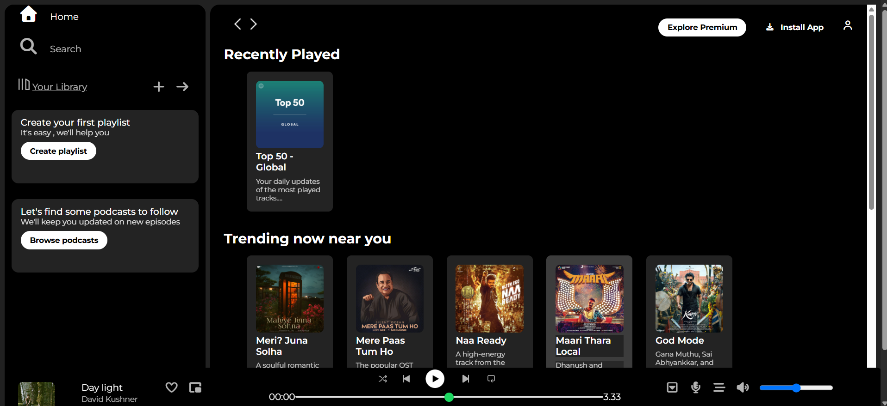

# Spotify-Inspired Music Player

A Spotify-inspired music player interface built from scratch using HTML and CSS.

## 📸 Project Preview

 

##🌐 Live Demo
https://dheeranjai01-codes.github.io/spotify-inspired-music-player/

## ✨ Features

- Spotify-inspired user interface
- Responsive layout
- Sidebar navigation
- Music cards
- Playback bar
- Hover effects
- CSS-based UI components

## 🛠️ Technologies Used

- HTML5
- CSS3
- Font Awesome
- Google Fonts

## 📚 What I Learned

- Building layouts using CSS Flexbox
- Creating responsive designs
- Using CSS positioning
- Creating hover effects and transitions
- Styling range inputs
- Structuring a multi-section web interface

## 🚀 Future Improvements

- Add JavaScript functionality
- Implement actual music playback
- Add working play/pause controls
- Add playlist functionality
- Further improve mobile responsiveness
